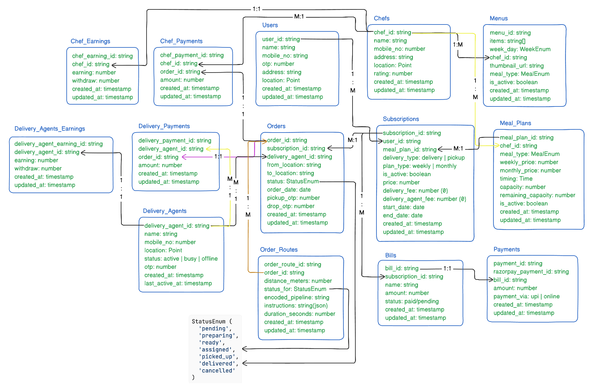

# CLAUDE.md

This file provides guidance to Claude Code (claude.ai/code) when working with code in this repository.


## Overview

Tiffin Delivery Service (TDS) is a Spring Boot 3.5 / Java 17 backend for a tiffin (home-cooked meal) subscription platform with three actors: **users** (order tiffins), **chefs** (offer meal plans), and **delivery agents** (deliver orders). The API is consumed by mobile (Expo) clients. All request/response bodies are wrapped in `ApiResponse` (`message`, `success`, `data`); errors use `ErrorResponse` (`message`, `success`, `errors`, `timestamp`) via `GlobalExceptionHandler`.

## Directory Structure

```
Tiffin-Delivery-Service/
├── .claude/                    # Claude Code configuration
│   ├── CLAUDE.md              # This file
│   ├── settings.json
│   └── settings.local.json
├── docker/                     # Docker compose files
│   └── graphhopper/           # GraphHopper routing (maps, config)
├── src/
│   ├── main/
│   │   ├── java/
│   │   │   └── com/example/tds/
│   │   │       ├── config/           # Spring configuration (Security, Web, Redis, MinIO, Firebase, Razorpay, WebClient)
│   │   │       ├── controller/       # REST controllers (User, Chef, DeliveryAgent, Order, Bill, Subscription, Menu, MealPlan)
│   │   │       │   └── sse/          # SSE controllers for real-time updates
│   │   │       ├── dto/
│   │   │       │   ├── requests/     # Request DTOs (organized by domain: bills, chefs, common, mealplans, menu, orders, payments, subscriptions, users)
│   │   │       │   └── responses/    # Response DTOs
│   │   │       ├── entity/           # JPA entities (User, Chef, DeliveryAgent, MealPlan, Menu, Subscription, Order, Bill, Payment, etc.)
│   │   │       ├── enums/            # Enumerations (OrderStatus, MealType, WeekDay, DeliveryType, PlanType, UserRole)
│   │   │       ├── exception/        # Custom exceptions (ResourceNotFoundException, InvalidOtpException, etc.)
│   │   │       ├── interceptors/     # HandlerInterceptors for auth (UserAuthInterceptor, ChefAuthInterceptor, DeliveryAgentAuthInterceptor)
│   │   │       ├── mapper/           # MapStruct mappers (entity ↔ DTO)
│   │   │       ├── projection/       # Native SQL interface projections for complex queries
│   │   │       ├── repository/       # Spring Data JPA repositories + custom native queries
│   │   │       ├── schedulers/       # Scheduled tasks (ExpiredSubscriptionsScheduler)
│   │   │       ├── service/          # Business logic services
│   │   │       ├── sqlScripts/       # SQL scripts (triggers, cron jobs)
│   │   │       ├── triggers/         # Postgres LISTEN/NOTIFY triggers (PostgresNotificationListener)
│   │   │       └── utilities/        # Utility classes (JwtUtility, etc.)
│   │   └── resources/
│   │       ├── application.properties
│   │       ├── db/                   # Database migration/init scripts
│   │       ├── static/               # Static resources
│   │       └── templates/            # Thymeleaf templates (if any)
│   └── test/
│       └── java/com/example/tds/     # Test classes
├── target/                         # Maven build output (ignored)
├── .env.example                    # Environment variables template
├── .gitignore
├── docker-compose.yml
├── mvnw.cmd                        # Maven wrapper (Windows)
├── pom.xml
└── README.md
```


## Build System

This project uses **Apache Maven** as the build manager. The Maven Wrapper (`./mvnw`) is provided for consistent builds across environments.

- **Wrapper script**: `./mvnw` (Unix/macOS), `mvnw.cmd` (Windows)
- **Wrapper config**: `.mvn/wrapper/maven-wrapper.properties` (pins Maven version)
- **Project descriptor**: `pom.xml` (dependencies, plugins, profiles)

## Common commands

```bash
docker compose up -d              # infra: Redis, MinIO, RedisInsight (GraphHopper service is commented out)
./mvnw clean package              # build (compiles, runs tests, packages JAR)
./mvnw spring-boot:run           # run on port 8000 (requires .env, see below)
./mvnw test                       # tests (only a basic context-load test exists)
./mvnw clean install -DskipTests  # build and install to local repo, skipping tests
```

- The app loads secrets from a gitignore `.env` file at startup (`Dotenv` in `TiffinDeliveryServiceApplication.main`, then feeds them to `application.properties` placeholders). Copy `.env.example` → `.env` and fill values before running.
- Swagger UI: `http://localhost:8000/swagger-ui/index.html` (spring doc).

## Architecture

### Authentication (interceptor-based, not Spring Security)

- All three actors use the same **OTP login flow**: `POST /otp/generate` (creates the entity + stores a random 4-digit OTP; SMS is a `// TODO`) then `POST /otp/verify` returns a JWT **access token (3h)** + **refresh token (7d)**. `POST /refresh` mints new token pairs. Tokens are signed HS256 with `security.jwt.secret-key` from config.
- Spring Security (`config/SecurityConfig`) only disables CSRF and `permitAll()`s everything under `/api/**`. **Real auth is done by three `HandlerInterceptor`s** — `UserAuthInterceptor`, `ChefAuthInterceptor`, `DeliveryAgentAuthInterceptor` — registered per role-path in `config/WebConfig` (which also holds CORS). Each interceptor validates the `Authorization: Bearer` token, loads the entity by `mobileNo` claim from the JWT, and sets it as a request attribute (`"user"`, `"chef"`, `"deliveryAgent"`). Controllers pull it in with `@RequestAttribute`, never parse tokens themselves.
- Excluded (unauthenticated) paths include OTP endpoints, signup, refresh, and location update/streaming endpoints (see `WebConfig.addInterceptors`).

### Domain model



- **Chef** 1→N **MealPlan** (weekly/monthly price, meal type, timing, capacity; `MealPlanEntity` validates prices/capacity in `@PrePersist`/`@PreUpdate`) and 1→N **Menu** (per `WeekDay` + `MealType`, an `items` list, `isActive`).
- **User** subscribes to a **MealPlan** via **Subscription** (`deliveryType` DELIVERY|PICKUP, `planType` WEEKLY|MONTHLY, price, delivery fee, start/end dates, `isActive`). Creating a subscription also creates a **Bill** (a Razorpay order) and decrements the meal plan's `remainingCapacity`.
- **Order** belongs to a Subscription, holds `fromLocation`/`toLocation`, `pickUpOtp`/`dropOtp` (random 1 000–9 999), `orderDate`, and a `status`. **Payments are per-order on delivery**, not per-subscription.
- Locations are PostGIS `geography(Point, 4326)` on users and chefs (JTS `Point` via hibernate-spatial). Delivery-agent live location lives in Redis GEO (see below).
- Rich list/detail queries use **native-SQL interface projections** (`projection/`) with snake_case→camelCase aliases — e.g. `OrderRepository.findByChefId` joins orders→subscriptions→users→meal_plans→chefs→menus matching the chef's **active menu for today's weekday + the plan's meal type**. When touching these, keep the alias names in sync with the projection interface.

### Order lifecycle & delivery matching

1. **Order generation**: activating a subscription (`is_active false→true`) fires a Postgres TRIGGER (`sqlScripts/NewOrdersCreationTrigger.sql`) which `pg_notify`s `new_orders_channel`. `triggers/PostgresNotificationListener` runs a raw-JDBC `LISTEN` thread (`postgres.listener.*` config) and calls `OrderService.createOrder(subscriptionId)`, which **bulk-creates one order per calendar day** of the subscription window.
2. **Chef updates** order status (single or bulk via `UpdateMultipleOrdersStatusRequest`) from `PENDING → PREPARING → READY` and triggers delivery assignment. Chef endpoints: `/api/chefs/{chefId}/orders/today`, `/status`, `/status` (bulk), `/assign`.
3. **Delivery matching** (`DeliveryService.getDeliveryAgent`): searches Redis GEO (`delivery_agents_location` key) for `ACTIVE` agents in an expanding 1→3 km radius band around the chef, pushes a **data-only FCM notification** (via `FCMService`) to each candidate, then **synchronously blocks on a `CountDownLatch`** for `delivery.wait.time.seconds` on a Redis pub/sub channel `order_{orderId}`. An accepting agent publishes `delivery_agent_{agentId}` (via `publishDeliveryRequest`). If none respond in radius 1, it retries radius 2, then 3. Failure to find any agent throws `ResourceNotFoundException`.
4. Order states: `PENDING → PREPARING → READY → ASSIGNED → PICKED_UP → DELIVERED | CANCELLED` (`enums/OrderStatus`).
   - **Pickup** (`PATCH /api/delivery-agents/{agentId}/orders/{orderId}/status/pickup`): order must be `ASSIGNED`, requires the pickup OTP.
   - **Delivery** (`.../status/delivered`): requires the drop OTP. For `DELIVERY` subscriptions the order must be `PICKED_UP`; for `PICKUP` subscriptions it must be `READY`. On success, it sets the agent back to `ACTIVE`, closes the agent's location stream, and calls `processPayments` (creates `DeliveryPayment` for the agent fee + `ChefPayment` for `price/7` weekly or `price/30` monthly).
   - **Cancellation** (`.../status/cancel`): only while `ASSIGNED`, only by the assigned agent. Deducts ₹5 from the agent's earnings, then tries to re-match; if no agent is found the order falls back to `READY` with no agent.
5. Route/navigation (chef → route endpoint): `DeliveryAgentService.getRouteForOrder` builds a leg per status — `ASSIGNED` ⇒ agent→chef, `PICKED_UP` ⇒ chef→user — via the **Google Maps Routes API** (`GoogleMapsRoutingService`, WebClient, two-wheeler), and **caches the result per (order, status)** in the `order_routes` table (`OrderRouteEntity`; instructions stored as JSON via `RouteInstructionsConverter`). GraphHopper dependencies/config exist but are not wired into compose anymore.

### Real-time delivery-agent location

- Agent live location flows in over **WebSocket** at `/api/delivery-agents/location` (`DeliveryAgentLocationController`, a `TextWebSocketHandler`). Each update is written to the Redis GEO set `delivery_agents_location` and **published to channel `agent_location_{agentId}`**.
- Users subscribe via **SSE** at `/api/delivery-agents/{agentId}/location/{orderId}` (`DeliveryAgentUpdatesController`): it forwards messages off that Redis channel. When an order is `DELIVERED`/`CANCELLED`, order-status updates publish a `CLOSE_{orderId}` message that terminates the SSE stream. `OrderService.updateOrderStatusEntity` is the central place this close-notification is sent.

### Pricing & payments

- Delivery fee = `distance.base.fee + ceil(distanceKm) * distance.rate.per.km`, rounded down to the nearest ₹10 (`DeliveryService.calculateDeliveryFee` / `SubscriptionService`). Distance uses `SubscriptionRepository.findDisInKm` (PostGIS `ST_Distance`).
- **Razorpay** (`RazorpayService`, configured in `config/RazorpayConfig`): an order is created when the bill is created; the returned Razorpay order id is stored on `BillEntity.orderId`. Client-side completion posts into `PaymentService`, and earnings accumulate in the `*_earnings` tables. `config/WebClientConfig` supplies the two configured `WebClient`s (Google Maps / razorpay, keyed by `@Qualifier`).

### Infrastructure / config

- **Datasource**: PostgreSQL (Neon) via `DATABASE_URL`, `ddl-auto=update`. A separate non-pooled `postgres.listener.*` connection powers the LISTEN/NOTIFY thread, and there's a DB-side pg_cron job (`sqlScripts/DeactivateSubscriptionScheduler.sql`) for expiring subscriptions — the same work is also done in-app by `schedulers/ExpiredSubscriptionsScheduler` (midnight Asia/Kolkata).
- **Redis**: GEO ops, pub/sub (delivery matching + agent location), `config/RedisConfig`. **MinIO** (S3) hosts menu thumbnails (`StorageService`, `config/MinioConfig`); bucket `menu-items`, 20 MB upload limit. **Firebase** admin SDK (`config/FirebaseConfig`, `service-account-key.json` on classpath or `FIREBASE_CONFIG_PATH`) powers FCM push.
- Stack conventions: Lombok `@RequiredArgsConstructor` + MapStruct mappers (`mapper/`) to convert entity→response, `@Slf4j` logging, builder-style DTOs, `@Transactional` on write flows. New config beans live in `config/`; JWT utils in `utilities/JwtUtility`.

## Gotchas

- **Order SQL aliases**: `OrderRepository` native queries alias `subscription.end_date` as `"subscriptionEndData"` (typo) and menus join to `m.week_day`/`m.meal_type` in different ways per query — the user/date variants require the weekday, the chef's today query does not. Preserve these quirks when editing (they're load-bearing for the projections).
- `MenuEntity.items` is a `List<String>` (PostgreSQL text[]) but several response mappers hand-parse it with `.replace("{", "").replace("}", "")` — new code should reuse the existing mappers rather than re-deriving.
- Delivery matching blocks the calling thread (`CountDownLatch`) for the wait window; an agent with no FCM token is skipped in `sendDeliveryRequestToAgents`.
- Active orders list for an agent filters `status IN ('ASSIGNED','PICKED_UP')` and excludes `CANCELLED`; the "all orders" variant only excludes `CANCELLED`.
- The generic `@ExceptionHandler(Exception.class)` is commented out in `GlobalExceptionHandler` — unexpected failures surface as default error handling.